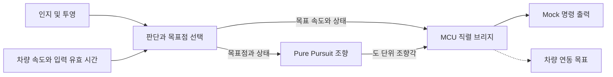

# 드림학기제 — ROS 2 / CARLA 판단·제어

**V-Model Neuro-Symbolic Driving · 건국대학교**

[English](README.md) · [프로젝트 포트폴리오](https://steveandy-sudo.github.io/projects/vmodel-neuro-symbolic/) · [실행 안내](docs/PORTFOLIO_SETUP.md)

학습 기반 인지, 규칙 기반 판단, 기하학적 경로 추종을 연결한 프로젝트입니다. 판단, waypoint 추종, Pure Pursuit 조향, 종방향 제어를 구현하고 이후 차량 MCU 인터페이스 연동을 진행했습니다.

| 기간 | 팀 | 개발 범위 | 상태 |
| --- | --- | --- | --- |
| 2026년 3–6월 | 3명 | 판단·제어 통합 | 프로젝트 종료 |

## 결과와 근거

**자율주행 목표를 달성하지 못했습니다. 개발 과정에서 추종 불안정성이 남았고, 최종 코드로 실제 차량 주행을 진행하지 못했습니다.** 이 저장소에는 구현과 디버깅 과정에서 다룬 문제를 보존했습니다.

| 단계 | 남아 있는 자료 | 확인 범위 |
| --- | --- | --- |
| ROS 2 / CARLA | waypoint·Pure Pursuit·속도 제어 코드와 수행자의 개발 기록 | 시뮬레이션 통합 및 추종 문제 조사 |
| 이후 ROS–MCU 연동 | 판단·조향 인터페이스, 직렬 브리지, mock launch | 최종 소스 구현 |
| 저장소 준비 | [원본 69개 보존, Python 42개 문법 확인](docs/VALIDATION.md) | 원본 일치와 문법 확인 |

조향 방향, lookahead, 평활화, 명령 변화량과 출력 범위를 조사했습니다. 단일 원인은 확정하지 못했으며, 설정별 비교 로그는 남아 있지 않습니다. [실험 기록](docs/EXPERIMENTS.md)에서 당시 관찰과 후속 분석 제안을 구분했습니다.

## 두 개발 단계

### CARLA 제어 실험

[보관된 구현](src/neuro_decision/archive)은 waypoint 판단, Pure Pursuit 조향과 종방향 제어를 포함합니다. Pure Pursuit 노드가 `CarlaEgoVehicleControl`을 발행하여 조향과 throttle/brake 입력을 시뮬레이터에 연결합니다.

### 이후 명령 인터페이스 연동

현재 패키지는 판단·목표점 선택, 조향 계산, 차량별 직렬 명령 변환을 분리합니다.



위 그림은 최종 소프트웨어 인터페이스를 나타냅니다. `e2e_mock`은 전체 소프트웨어 연결을 실행하는 이름이며, 주행 구조는 학습 기반 인지와 명시적인 판단·제어 규칙을 결합합니다.

## 설계 선택과 디버깅 질문

| 구현 | 코드의 처리 | 확인할 질문 |
| --- | --- | --- |
| 목표점 기반 조향 | 목표 좌표·축거로 Pure Pursuit 계산 | 좌표축, 조향 부호와 차량 형상이 일치하는가? |
| 상태별 조향 처리 | gain, 지수 평활화, 주기당 변화량 제한 | 평활화가 진동을 줄이는 동시에 응답 지연을 더하는가? |
| 출력 단위 명시 | 도 단위와 정규화 조향값 발행 | 각 수신 노드가 기대하는 단위·범위를 받는가? |
| 입력 유효 시간 확인 | 목표·상태가 오래되거나 미지 상태면 조향 0 출력 | 추종 중단이 기하 계산 때문인가, 입력 지연 때문인가? |
| 직렬 브리지 분리 | 목표 속도·조향·상태를 MCU 프로토콜로 변환 | ROS에서 보낸 명령과 구동기가 해석하는 명령이 같은가? |

위 질문은 구현을 분석하는 관점을 제시합니다. 현재 자료만으로는 각 설정이 당시 추종 불안정성에 미친 영향을 분리할 수 없습니다.

## 코드 읽기 안내

| 구성 | 주요 코드 |
| --- | --- |
| 상태·목표점·목표 속도 | [판단 노드](src/neuro_decision/neuro_decision/behavior_node.py) |
| Pure Pursuit·필터·조향 제한 | [조향 노드](src/neuro_decision/neuro_decision/steering_command_node.py) |
| 이전 시뮬레이터 제어 | [CARLA Pure Pursuit](src/neuro_decision/archive/pure_pursuit_node.py) · [속도 제어](src/neuro_decision/archive/speed_control_node.py) |
| 차량 명령 변환 | [MCU 직렬 브리지](src/vehicle_serial_bridge/vehicle_serial_bridge/mcu_serial_bridge.py) |
| 패키지 통합 | [Mock launch](src/autonomous_bringup/launch/e2e_mock.launch.py) · [인지 브리지](src/yolopv2_ros/launch/perception_planning_bridge.launch.py) |

## 빌드와 확인

ROS 2 Humble과 패키지에 선언된 의존성이 필요합니다. 인지 실행에는 호환되는 YOLOPv2 코드·가중치와 카메라 또는 영상 입력이, 이전 시뮬레이터 코드에는 CARLA와 ROS bridge가 필요합니다. 저장소 루트에서 빌드합니다.

```bash
source /opt/ros/humble/setup.bash
colcon build --packages-select neuro_decision vehicle_serial_bridge yolopv2_ros autonomous_bringup
source install/setup.bash
```

[실행 안내](docs/PORTFOLIO_SETUP.md)에 mock 확인 방법, 외부 자료와 원본 코드의 알려진 문제를 정리했습니다. 현재 실행 항목과 보관된 CARLA 스크립트도 구분했습니다. 오프라인 준비 과정에서 전체 ROS/CARLA 빌드는 실행하지 않았습니다.

- **결과 이해:** [실험·디버깅 기록](docs/EXPERIMENTS.md)
- **원본 확인:** [출처 기록](docs/SOURCE_MAP.md) · [검증 기록](docs/VALIDATION.md)
- **기존 문서:** [원본 README](README.upstream.md)

## 개발을 통해 얻은 관점

좌표, 명령 단위, 입력 주기와 구동기 응답을 함께 확인해야 한다는 과제를 경험했습니다. 후속 실험에서는 경로와 입력을 고정하고 제어 설정 하나를 바꾸며, 목표점·조향 명령·실제 응답·경로 오차를 같은 시간축에 기록하는 것이 필요합니다.
