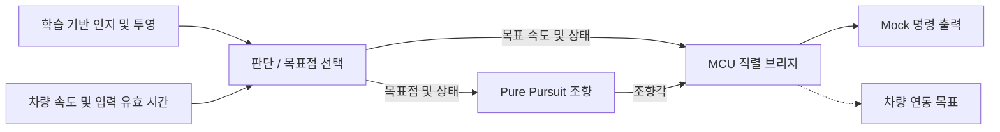

# V-Model Neuro-Symbolic Driving

**ROS 2 판단·경로 추종·제어 통합의 구현 및 디버깅 기록입니다.**

[English](README.md) · [프로젝트 포트폴리오](https://steveandy-sudo.github.io/projects/vmodel-neuro-symbolic/) · [실행 안내](docs/PORTFOLIO_SETUP.md)

학습 기반 인지와 규칙 기반 판단, 기하학적 경로 추종을 연결하는 주행 플랫폼에서 판단·제어 통합을 담당했습니다. ROS 2/CARLA 연결, waypoint 추종, Pure Pursuit, 종방향 속도 제어를 구현하고 이후 MCU 명령 인터페이스 연결 작업을 진행했습니다.

**최종 결과: 자율주행 목표 달성에 실패한 프로젝트입니다. 최종 코드로 실제 차량 주행을 진행하지 못했습니다.** 이 저장소에는 당시 구현 내용과 통합 시도, 해결하지 못한 경로 추종 문제를 기록했습니다.

| 항목 | 내용 |
| --- | --- |
| 프로그램 | 건국대학교 드림학기제 |
| 기간 | 2026년 3–6월 |
| 팀 규모 | 3명 |
| 개발 범위 | 판단 및 제어 통합 |
| 상태 | 프로젝트 종료, 주행 목표 미달성 |
| 최종 원본 | 확인된 `main` 버전, `c28f7a6` |

## 수행한 작업

- ROS 2/CARLA 개발 환경에서 판단, waypoint 추종, Pure Pursuit 조향, 종방향 속도 제어를 구현했습니다.
- 폐루프 시뮬레이션 과정에서 조향 방향, lookahead 거리, 목표점 평활화, 명령 변화율 및 출력 범위를 조사하고 조정했습니다.
- 이후 MCU 연결을 위해 목표 속도·조향각과 차량의 직렬 명령 형식을 연결하는 작업을 진행했습니다.
- 상태와 명령을 관찰할 수 있도록 진단용 토픽을 활용했습니다.

## 코드에 남아 있는 두 개발 단계

### 1. CARLA 경로 추종 실험

[보관된 제어 코드](src/neuro_decision/archive)에는 waypoint 판단, Pure Pursuit, 속도 제어 구현이 있습니다. Pure Pursuit 노드는 조향과 throttle/brake 입력을 결합하여 `CarlaEgoVehicleControl`을 발행합니다. 이 파일들은 시뮬레이션 개발 과정을 담고 있습니다.

### 2. 이후 ROS–MCU 연결

현재 패키지는 판단·목표점 생성과 조향 명령 생성을 분리합니다. 직렬 브리지는 목표 속도, 조향각, 상태를 MCU 프로토콜로 변환하며, mock launch로 직렬 장치 없이 명령 연결을 살펴볼 수 있도록 구성되어 있습니다. 이 구조는 최종 구현 범위를 나타내며 실제 차량 주행 성과를 뜻하지 않습니다.



`e2e_mock`과 같은 파일명의 E2E는 인지부터 명령 출력까지 **소프트웨어 전체 연결**을 가리킵니다. 학습 기반 end-to-end 자율주행 모델을 구현했다는 의미는 아닙니다.

## 핵심 코드

| 파일 | 확인할 내용 |
| --- | --- |
| [판단 노드](src/neuro_decision/neuro_decision/behavior_node.py) | 상태 선택, 목표점·속도 생성, 입력 유효 시간 |
| [조향 노드](src/neuro_decision/neuro_decision/steering_command_node.py) | Pure Pursuit 계산, 상태별 gain, 평활화와 명령 제한 |
| [CARLA Pure Pursuit](src/neuro_decision/archive/pure_pursuit_node.py) | 조향·throttle·brake를 차량 제어 메시지로 연결 |
| [종방향 제어](src/neuro_decision/archive/speed_control_node.py) | 속도 피드백과 가감속 명령 |
| [MCU 브리지](src/vehicle_serial_bridge/vehicle_serial_bridge/mcu_serial_bridge.py) | 명령 형식, timeout, 정지 상태 및 mock 출력 |
| [통합 launch](src/autonomous_bringup/launch/e2e_mock.launch.py) | 인지·판단·브리지 연결 |

## 디버깅 과정

| 조사 항목 | 진행한 작업 |
| --- | --- |
| 조향 방향 | 목표점 위치와 조향 부호가 시뮬레이터 반응에 어떻게 연결되는지 확인 |
| Lookahead | 목표점을 추종하는 거리 조정 |
| 평활화 | 불안정한 추종을 조사하면서 목표점·조향 평활화 조정 |
| 변화율 제한 | 명령이 빠르게 변하는 구간 조사 |
| 명령 범위 | 정규화 조향값, 각도 단위와 허용 범위 확인 |

조정 이후에도 안정적인 자율주행에 도달하지 못했고, 단일 원인을 확정하지 못했습니다. [실험 기록](docs/EXPERIMENTS.md)에 당시 결과와 후속 개발에 참고할 점을 정리했습니다.

## 구성과 실행

판단·제어, MCU 브리지, 인지, 통합 launch의 ROS 패키지 4개와 기존 문서·보조 스크립트를 포함하여 **원본 파일 69개**를 보존했습니다. 학습 가중치, 데이터셋과 입력 영상은 별도로 필요합니다.

```bash
source /opt/ros/humble/setup.bash
colcon build --packages-select neuro_decision vehicle_serial_bridge yolopv2_ros autonomous_bringup
source install/setup.bash
```

환경과 mock 실행 조건은 [실행 안내](docs/PORTFOLIO_SETUP.md), 원본 대응 관계는 [출처 기록](docs/SOURCE_MAP.md), 이번 정리 과정의 검사는 [검증 기록](docs/VALIDATION.md)에 있습니다.

## 배운 점

목표 좌표, 조향 단위, 입력 주기, 차량 명령을 함께 점검해야 한다는 점을 경험했습니다. 또한 매개변수를 변경할 때 입력 조건과 실제 반응을 같이 기록해야 개별 변경의 효과를 판단할 수 있다는 과제를 확인했습니다. 이후 프로젝트에서는 이 경험을 바탕으로 통합 조건과 실험 기록을 더 체계적으로 다루고자 했습니다.
