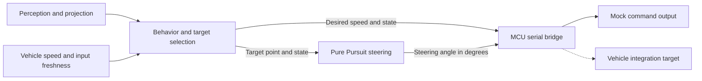

# Dream Semester — ROS 2 / CARLA Decision and Control

**V-Model Neuro-Symbolic Driving · Konkuk University**

[한국어](README.ko.md) · [Project portfolio](https://steveandy-sudo.github.io/projects/vmodel-neuro-symbolic/) · [Code guide](#code-guide) · [Setup](docs/PORTFOLIO_SETUP.md)

This project explored the connection between learned perception, rule-based behavior, and geometric path tracking. My work covered decision-making, waypoint following, Pure Pursuit steering, longitudinal control, and later adaptation to a vehicle MCU interface.

| Period | Team | Development focus | Status |
| --- | --- | --- | --- |
| March–June 2026 | 3 members | Decision-making and control integration | Project ended |

## Outcome and evidence

**The autonomous-driving objective was not achieved. Tracking remained unstable during development, and the final code did not lead to an actual vehicle run.** The repository preserves the implementation and the debugging questions that emerged from it.

| Stage | What is available | Evidence scope |
| --- | --- | --- |
| ROS 2 / CARLA | Archived waypoint, Pure Pursuit, and speed-control code; author's development account | Simulation integration and tracking investigation |
| Later ROS-to-MCU adaptation | Behavior/steering interfaces, serial bridge, and mock launch files | Final source implementation |
| Repository preparation | [69 source files preserved; 42 Python files parsed](docs/VALIDATION.md) | Source consistency and syntax, not control performance |

The recorded investigations concern steering direction, lookahead, smoothing, command change limits, and output bounds. A single root cause was not established, and comparative logs are unavailable. [Experiment notes](docs/EXPERIMENTS.md) keep the observed outcome separate from proposed diagnostic steps.

## Two development stages

### CARLA control experiments

The [archived implementations](src/neuro_decision/archive) combine waypoint behavior, Pure Pursuit steering, and longitudinal control. The Pure Pursuit node publishes `CarlaEgoVehicleControl`, connecting steering and throttle/brake inputs to the simulator.

### Later command-interface integration

The current packages separate behavior selection, steering generation, and vehicle-specific serialization:



This diagram describes the final software interfaces. `e2e_mock` names an integrated software launch; the project's driving architecture combines learned perception and explicit decision/control rules.

## Design choices and debugging questions

| Implementation | What the code does | Diagnostic question |
| --- | --- | --- |
| Target-based steering | Computes Pure Pursuit from target coordinates and wheelbase | Are target axes, steering sign, and vehicle geometry consistent? |
| State-dependent steering | Applies gain, exponential smoothing, and a per-cycle change limit | Does filtering reduce command jitter while adding response delay? |
| Explicit output units | Publishes steering in degrees and a normalized form | Does each downstream consumer receive its expected scale? |
| Input freshness handling | Outputs zero steering for stale target/state or unknown state | Is a tracking interruption caused by geometry or an input timeout? |
| Separate serial bridge | Converts desired speed, steering, and state to the MCU protocol | Is the command that leaves ROS the command the actuator expects? |

These questions explain how the implementation can be inspected. The available record does not isolate the contribution of each setting to the observed instability.

## Code guide

| Component | Start here |
| --- | --- |
| Behavior, target point, and desired speed | [Behavior node](src/neuro_decision/neuro_decision/behavior_node.py) |
| Pure Pursuit, filters, and steering limits | [Steering node](src/neuro_decision/neuro_decision/steering_command_node.py) |
| Earlier simulator control | [CARLA Pure Pursuit](src/neuro_decision/archive/pure_pursuit_node.py) · [Speed control](src/neuro_decision/archive/speed_control_node.py) |
| Vehicle command formatting | [MCU serial bridge](src/vehicle_serial_bridge/vehicle_serial_bridge/mcu_serial_bridge.py) |
| Package integration | [Mock launch](src/autonomous_bringup/launch/e2e_mock.launch.py) · [Perception bridge](src/yolopv2_ros/launch/perception_planning_bridge.launch.py) |

## Build and inspect

Use ROS 2 Humble with the declared package dependencies. Perception additionally requires compatible YOLOPv2 code/weights and camera or video input; archived simulator code requires CARLA and its ROS bridge. From this repository root:

```bash
source /opt/ros/humble/setup.bash
colcon build --packages-select neuro_decision vehicle_serial_bridge yolopv2_ros autonomous_bringup
source install/setup.bash
```

The [setup guide](docs/PORTFOLIO_SETUP.md) covers mock inspection, external assets, and preserved source issues. It also distinguishes current package entry points from archived CARLA scripts. A full ROS/CARLA build was not performed during offline preparation.

- **Understand the outcome:** [Experiment and debugging record](docs/EXPERIMENTS.md)
- **Inspect the snapshot:** [Source provenance](docs/SOURCE_MAP.md) · [Validation](docs/VALIDATION.md)
- **Read original context:** [Preserved upstream README](README.upstream.md)

## Engineering takeaway

The work made interface consistency a concrete debugging concern: coordinates, command units, input timing, and actuator response must be examined together. A useful next experiment would hold the route and inputs fixed, change one control setting, and record target geometry, commanded steering, measured response, and path error on the same timeline.
