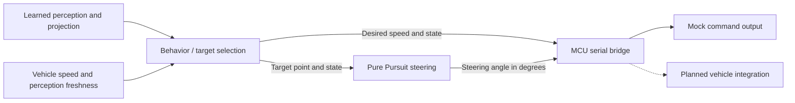

# V-Model Neuro-Symbolic Driving

**ROS 2 decision-making, path tracking, and control integration — implementation and debugging record.**

[한국어](README.ko.md) · [Project portfolio](https://steveandy-sudo.github.io/projects/vmodel-neuro-symbolic/) · [Code guide](#code-guide) · [Setup](docs/PORTFOLIO_SETUP.md)

I worked on decision-making and control integration for a driving platform combining learned perception with rule-based behavior and geometric path tracking. The work covered ROS 2/CARLA integration, waypoint following, Pure Pursuit, longitudinal control, and later adaptation to an MCU command interface.

**Outcome:** The project failed to achieve its autonomous-driving objective. The final code did not lead to an actual vehicle run. This repository records the implementation, integration attempts, and unresolved tracking problems from that work.

| Context | Details |
| --- | --- |
| Program | Dream Semester Project, Konkuk University |
| Period | March–June 2026 |
| Team | Three members |
| Development focus | Decision-making and control integration |
| Status | Project ended; driving objective unmet |
| Final source | Confirmed `main` snapshot, `c28f7a6` |

## Development work

- Implemented decision-making, waypoint following, Pure Pursuit steering, and longitudinal speed control for the ROS 2/CARLA development environment.
- Investigated steering direction, lookahead distance, target smoothing, command rate limits, and output bounds during closed-loop simulation work.
- Worked on the later MCU interface, separating desired speed and steering angle from the vehicle-specific serial command format.
- Retained diagnostic state and command topics to inspect behavior transitions and control outputs.

## Two stages in the source

### 1. CARLA path-tracking experiments

The [archived control code](src/neuro_decision/archive) contains waypoint behavior, Pure Pursuit, and speed-control implementations. The Pure Pursuit node combines steering with throttle/brake inputs and publishes `CarlaEgoVehicleControl`. These files document the simulation development stage.

### 2. Later ROS-to-MCU integration

The current package entry points separate behavior and target selection from steering commands. The serial bridge converts desired speed, steering angle, and behavior state into the MCU protocol. Mock launch files support inspecting this connection without a serial device. These are implementation paths in the final source, not evidence of a successful vehicle run.



This diagram describes the later software interfaces. In launch names such as `e2e_mock`, **E2E means the full software connection from perception through command output**. It does not refer to a learned end-to-end driving model.

## Code guide

| Component | Reading focus |
| --- | --- |
| [Behavior node](src/neuro_decision/neuro_decision/behavior_node.py) | Behavior selection, target points, desired speed, and input freshness |
| [Steering node](src/neuro_decision/neuro_decision/steering_command_node.py) | Pure Pursuit geometry, state-specific gains, smoothing and output limits |
| [Archived CARLA Pure Pursuit](src/neuro_decision/archive/pure_pursuit_node.py) | Steering, throttle/brake inputs, and CARLA control-message publication |
| [Archived speed control](src/neuro_decision/archive/speed_control_node.py) | Speed feedback and longitudinal commands |
| [MCU bridge](src/vehicle_serial_bridge/vehicle_serial_bridge/mcu_serial_bridge.py) | Command formatting, timeouts, stop states and mock output |
| [Mock bringup](src/autonomous_bringup/launch/e2e_mock.launch.py) | Perception, decision and bridge composition |
| [Perception bridge](src/yolopv2_ros/launch/perception_planning_bridge.launch.py) | Image input, inference and projection connections |

## Debugging record

| Area | Investigation |
| --- | --- |
| Steering direction | Checked how target geometry and steering sign mapped to the simulated response |
| Lookahead | Adjusted the target-following distance |
| Smoothing | Adjusted target and steering smoothing while investigating unstable tracking |
| Rate limiting | Examined how rapidly command output could change |
| Command bounds | Checked normalized steering, steering angle and allowable ranges |

These changes did not establish stable autonomous driving. A single root cause was not conclusively isolated. [Experiment notes](docs/EXPERIMENTS.md) separate the recorded investigations, final outcome, and lessons for subsequent work.

## Repository layout

```text
src/
  neuro_decision/        # Behavior, steering, and archived CARLA control
  vehicle_serial_bridge/# Desired commands to MCU protocol
  yolopv2_ros/           # Perception and projection nodes
  autonomous_bringup/    # Integrated launch files
perception/lane_detection/ # Separate training/inference scripts
scripts/                # ROS topic and preflight inspection
docs/                   # Setup, experiments, provenance and validation
```

The collection preserves **69 original files**. Model weights, datasets, and video inputs are external to this snapshot. The original root README is retained as [README.upstream.md](README.upstream.md).

## Build and inspect

In a ROS 2 Humble environment with the package dependencies installed:

```bash
source /opt/ros/humble/setup.bash
colcon build --packages-select neuro_decision vehicle_serial_bridge yolopv2_ros autonomous_bringup
source install/setup.bash
```

See [setup and source limitations](docs/PORTFOLIO_SETUP.md) for mock inspection, missing external assets, and the distinction between archived CARLA code and current package entry points. Collection checks are documented in [VALIDATION.md](docs/VALIDATION.md).

## Lessons

This project made the interfaces between perception, behavior, and control a concrete debugging concern: target coordinates, steering units, input timing, and actuator commands all need to agree. It also motivated a more systematic experiment record—capturing the input, parameter change, and observed response together so that the effect of each change can be evaluated.

[Source provenance](docs/SOURCE_MAP.md) · [Experiment record](docs/EXPERIMENTS.md)
